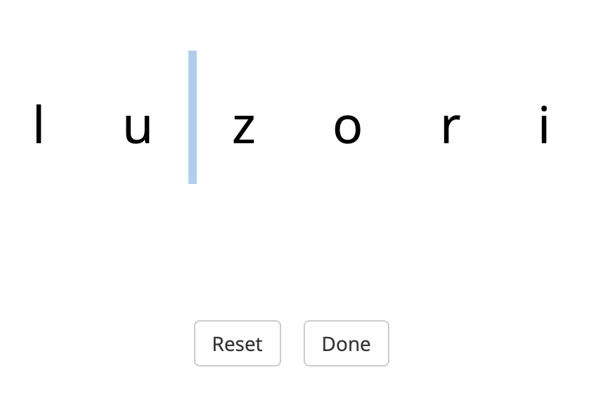

# Orthographic segmentation: Plugins for jsPsych 7


## The orthographic segmentation task

The statistical learning/segmentation study by [Kurumada et al. (2013)](https://langcog.stanford.edu/papers/KMF-cognition2013.pdf) test how people would segment a continuous orthographic sequence by asking them to click between letters where they think the word boundaries should be.


With help from [Aislinn Keogh](http://aislinnkeogh.github.io), I adapted this idea into a task that would let participants place one morpheme boundary per word.
(This code could definitely be adapted to allow multiple boundaries.)




## How to use

Give the orthographic segmentation task a try by opening [`index.html`](index.html) in a browser.

The experiment code can be found in [`demo.js`](demo.js).

The two custom plugins we wrote are [`plugin-orthographic-seg.js`](jspsych7.3.1/plugin-orthographic-seg.js) and [`plugin-orthographic-confirm.js`](jspsych7.3.1/plugin-orthographic-confirm.js).


## Citation

If you use this code, you can cite this repository:

```
@misc{Pankratz_Orthseg_2024,
  author = {Pankratz, Elizabeth},
  title = {{Orthographic segmentation: Plugins for jsPsych 7}},
  url = {https://github.com/elizabethpankratz/orthographic-segmentation-jspsych},
  year = {2024}
}
```
